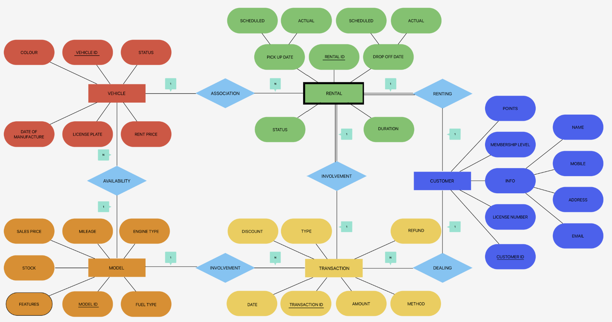

# Car Dealership Management System

This project is a **Car Dealership Management System** implemented using **MySQL** and **Python**. It enables managing car models, rentals, purchases, customers, and transactions efficiently.

## Problem Statement
- An effective and all-encompassing management system is necessary for an automobile dealership to manage its rental, resale, and sales activities. 
- A consolidated platform for managing inventory, customer data, sales transactions, resale procedures, and rental operations should be made available by the system. 
- The objective is to increase overall operational efficiency, improve customer experience, and streamline daily operations at the dealership

## Project Description
The system provides functionalities to:
- Inventory management: Maintain a record of all the new cars that are available, including the make, model, year, color, VIN (Vehicle Identification Number), and price of purchase. As vehicles are hired out, sold, or resold, the inventory is updated instantly.
- Customer management: Keep track of names, contact information, and past purchases in a database of your customers. Maintain a record of client preferences and offer tailored services both during and after the sale.
- Sales and Operations: Enable sales reps to initiate sales transactions, produce invoices, and note payment information to streamline the sales process. Provide reports on revenue, popular models, and sales performance.
- Rental Management: Control rental reservation details, such as vehicle availability, length of rental, and client information. Create invoices, compute rental fees, and keep track of rental transactions.
- Resales Management: MOversee the procedure whereby clients exchange their current vehicles for new ones. Make the necessary updates to the customer and inventory records.
- Analytics and Reporting: Reports on a range of topics should be provided, including financial summaries, customer trends, inventory status, and sales performance. Use analytics to find areas for strategic decision-making and areas for improvement.
- Authorization and Authentication of Users: To protect data integrity and privacy, provide dealership employees with role-based access control and secure login procedures.
- Scope to include more functionalities are further elaborated on in future planning, which can be integrated with the existing work flow.

## Assumptions
- Each transaction done by a customer is for a single car(buy/rent)
- One customer can rent only a single car at a time
- One vehical can only be associated to one rental at a given time
- Multiple cars of the same model can be in stock for sale 
- Transaction/rental cannot exist without a customer who is willing to buy/rent, and a vehicle that is in stock

## Entity-Relationship Diagram (ERD)
The relational schema includes the following tables:
- **MODEL:** Stores car models with attributes like fuel type, mileage, and price.
- **VEHICLE:** Stores individual cars available for sale or rental.
- **CUSTOMER:** Maintains customer information and membership levels.
- **TRANSACTION:** Records purchase and rental transactions.
- **RENTAL:** Manages rental transactions with start and end dates.
- **FEATURES:** Stores optional add-ons for car models.




## Installation
```bash
# Clone the repository
git clone https://github.com/RakshaMiglani/car-dealership-management.git

# Install dependencies
pip install oracledb tabulate

# Run the database setup script
python create.py

# Run the main application
python dbms.py
```

## Usage
Run `create.py` to create the required tables in the database
Run `dbms.py` to interact with the dealership management system via a menu-driven interface.

